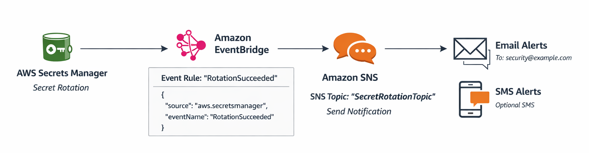

# terraform-aws-notify-on-secret-rotation

Terraform module to notify on AWS Secrets Manager rotation events using EventBridge and SNS.

## High-Level Architecture Diagram


## What it does
- Creates an SNS topic and email subscriptions
- Creates an EventBridge rule for Secrets Manager rotation success events
- Sends a notification to SNS using an EventBridge target
- Creates an IAM role for EventBridge with an optional permissions boundary

## Requirements
- Terraform >= 1.3
- AWS Provider >= 5.0

## Usage
```hcl
module "notify_on_secret_rotation" {
  source = "git::https://github.com/mythun-engg/terraform-aws-notify-on-secret-rotation.git?ref=0.0.1"

  topic_name = "secret-rotation-topic"

  email_subscriptions = [
    "security@example.com",
    "cloud-ops@example.com"
  ]

  secret_arns = [
    "arn:aws:secretsmanager:us-east-1:123456789012:secret:prod/db-credentials-abc123"
  ]

  tags = {
    Environment = "prod"
    Owner       = "security"
  }
}
```

<!-- BEGIN_TF_DOCS -->
## Requirements

| Name | Version |
|------|---------|
| <a name="requirement_terraform"></a> [terraform](#requirement\_terraform) | >= 1.3.0 |
| <a name="requirement_aws"></a> [aws](#requirement\_aws) | >= 5.0 |

## Modules

No modules.

## Resources

| Name | Type |
|------|------|
| [aws_cloudwatch_event_rule.this](https://registry.terraform.io/providers/hashicorp/aws/latest/docs/resources/cloudwatch_event_rule) | resource |
| [aws_cloudwatch_event_target.sns](https://registry.terraform.io/providers/hashicorp/aws/latest/docs/resources/cloudwatch_event_target) | resource |
| [aws_iam_role.eventbridge](https://registry.terraform.io/providers/hashicorp/aws/latest/docs/resources/iam_role) | resource |
| [aws_iam_role_policy.eventbridge_publish](https://registry.terraform.io/providers/hashicorp/aws/latest/docs/resources/iam_role_policy) | resource |
| [aws_sns_topic.this](https://registry.terraform.io/providers/hashicorp/aws/latest/docs/resources/sns_topic) | resource |
| [aws_sns_topic_policy.this](https://registry.terraform.io/providers/hashicorp/aws/latest/docs/resources/sns_topic_policy) | resource |
| [aws_sns_topic_subscription.email](https://registry.terraform.io/providers/hashicorp/aws/latest/docs/resources/sns_topic_subscription) | resource |
| [aws_caller_identity.current](https://registry.terraform.io/providers/hashicorp/aws/latest/docs/data-sources/caller_identity) | data source |

## Inputs

| Name | Description | Type | Default | Required |
|------|-------------|------|---------|:--------:|
| <a name="input_topic_name"></a> [topic\_name](#input\_topic\_name) | Name of the SNS topic. | `string` | n/a | yes |
| <a name="input_aws_region"></a> [aws\_region](#input\_aws\_region) | AWS region for provider configuration. | `string` | `"us-east-1"` | no |
| <a name="input_email_subscriptions"></a> [email\_subscriptions](#input\_email\_subscriptions) | Email addresses to subscribe to the SNS topic. | `list(string)` | `[]` | no |
| <a name="input_event_pattern_json"></a> [event\_pattern\_json](#input\_event\_pattern\_json) | Optional raw JSON string to override the default EventBridge event pattern. | `string` | `null` | no |
| <a name="input_eventbridge_role_name"></a> [eventbridge\_role\_name](#input\_eventbridge\_role\_name) | IAM role name used by EventBridge to publish to SNS. | `string` | `"eventbridge-sns-publish"` | no |
| <a name="input_kms_key_id"></a> [kms\_key\_id](#input\_kms\_key\_id) | KMS key ID or ARN to encrypt the SNS topic. | `string` | `null` | no |
| <a name="input_rule_description"></a> [rule\_description](#input\_rule\_description) | Description of the EventBridge rule. | `string` | `"Notify on AWS Secrets Manager rotation success."` | no |
| <a name="input_rule_name"></a> [rule\_name](#input\_rule\_name) | Name of the EventBridge rule. | `string` | `"secrets-rotation-notifications"` | no |
| <a name="input_secret_arns"></a> [secret\_arns](#input\_secret\_arns) | Secret ARNs to filter rotation/update events. Leave empty to match all secrets. | `list(string)` | `[]` | no |
| <a name="input_tags"></a> [tags](#input\_tags) | Tags to apply to created resources. | `map(string)` | `{}` | no |
| <a name="input_topic_display_name"></a> [topic\_display\_name](#input\_topic\_display\_name) | Display name for the SNS topic. | `string` | `null` | no |

## Outputs

| Name | Description |
|------|-------------|
| <a name="output_event_rule_arn"></a> [event\_rule\_arn](#output\_event\_rule\_arn) | ARN of the EventBridge rule. |
| <a name="output_sns_topic_arn"></a> [sns\_topic\_arn](#output\_sns\_topic\_arn) | ARN of the SNS topic. |
<!-- END_TF_DOCS -->